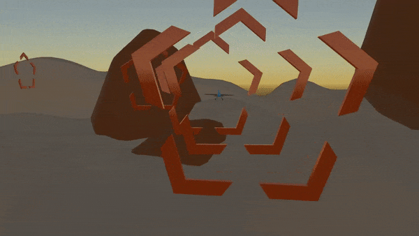

# reinforcementLearningAirplane
Airplane learning to fly through a race track using Deep Reinforcement Learning and Unity(Using MLAgents 0.11.0). Each time the agent goes through the checkpoint prefab it is rewarded with +1, and each time it hits a rock or the map it gets punished with -1.

Built with C# and Python.

Dependencies: 
MLAgents

TensorFlow

InputSystem

What the Model Looks like after 1 million steps: 

Made By: Samuel Boylan-Sajous
